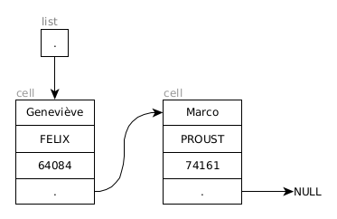
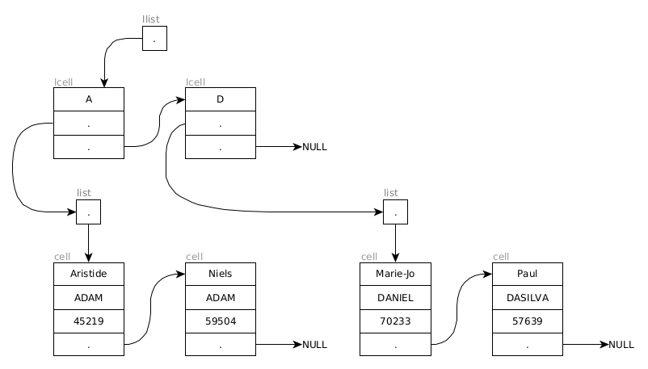

# Projet de C : Annuaire et tri de données

### Introduction

L'objectif du projet cette année est de mettre en place un gestionnaire de données du type `Prénom, Nom, Code Postal;`. La première partie définit une structure données qui n'est autre qu'une liste chaînée dans laquelle ces informations seront stockées. La deuxième partie lit se concentre sur la lecture des données depuis un fichier et de structuration intelligente au chargement. La troisième partie utilise une structure de données plus optimisée, une liste chaînée de listes chaînées. La quatrième partie définit plusieurs requêtes sur la structure de données. 

Un squelette du projet vous est proposé et contient :

- une structure de projet C à respecter avec son `makefile` dédié
- `list.h`, le header contenant la première structure ainsi que les signatures des fonctions à créer
- `list.c`, le fichier à compléter avec vos fonctions
- `main.c`, le fichier qui permet de s'interfacer avec vos fonctions (et d'y écrire vos tests !)
- `data`, le dossier dans lequel plusieurs bases de données vous sont proposées, à noter que nous testerons votre projet avec des bases de données différentes mais équivalentes


### Première partie : Structure de données

Les structure de données `list` et `cell`  vous sont données et permettent de définir une liste chaînées de personnes à partir de leurs informations : nom, prénom et code postal (ou `fname`, `lname` et `zip`). Un exemple d'utilisation de ces structures de données vous est illustré sur la figure ci-dessous.

<p align="center">
  
</p>

1. Écrire une fonction `make_cell` qui crée une cellule à partir des informations de ses champs.

2. Écrire une fonction `push` qui ajoute une cellule dont on donne le pointeur en tête de liste.

3. Écrire une fonction `print_cell` capable d'afficher le contenu d'une cellule sous la forme `[prénom, nom, code postal]`.

4. Écrire une fonction `print_list` capable d'afficher le contenu d'une liste sous la forme 
   ````c
   {
    [prénom 1, nom 1, code postal 1],
    [prénom 2, ...], 
   ...
   }
   ````

5. Écrire une fonction `pop` dont la signature vous est donnée qui enlève la cellule en tête de liste et renvoie le pointeur vers sa valeur. La tester à l'aide des fonctions d'affichage dédiées.

### Deuxième partie : Lecture de données

Il faut maintenant lire les données depuis un fichier et les ajouter dynamiquement dans votre structure. Les fichiers présents dans le répertoire `data` peuvent vous servir de tests pour vos fonctions. Trois fichiers de taille différente vous sont proposés contenant respectivement 100, 30000 et 100000 entrées.

1. Écrire une fonction `make_cell_from_line` qui crée une cellule à partir d'une ligne de données.

2. Écrire une fonction `load_file` qui ajoute toutes les données d'un fichier dans votre liste.

3. Écrire une fonction `compare_cells` qui compare deux cellules selon leur nom de famille (puis prénom si égaux) par ordre alphabétique.

4. Écrire une fonction `insert` qui ajoute une nouvelle donnée au bon endroit (selon l'ordre défini ci-dessus) dans la structure de données. Modifier votre fonction `load_file` pour utiliser cette nouvelle fonctionnalité.
5. Afficher la liste chargée et vérifier qu'elle est correctement triée.

> ***Note:** les fonctions de la librairie `string.h` vous seront utiles.*

### Troisième partie : Structure de données optimisée

Pour éviter de devoir traverser toutes les entrées en cas d'ajout d'une nouvelle, nous décidons de rajouter la première lettre de chaque nom comme caractère discriminant. Nous allons maintenant utiliser une liste chaînée de liste chaînées, la première représentant les premières lettres des noms de famille, pour accélérer l'accès aux données et l'ajout d'une nouvelle donnée. Un exemple d'utilisation est présentée sur la figure ci-dessous.

<p align="center">
  
</p>

1. Définir votre structure et votre nouveau type de cellule.

2. Définir les fonctions  associées à votre nouveau type de données (les équivalents de `make_cell`, `compare_cells`,  `insert` et `load_file` ainsi que les fonctions de construction et destruction).

3. En utilisant les fichiers les plus volumineux, mesurer le temps de création total des deux structures de données. Mesurer les différences de temps sur les différents fichiers fournis (si possible !).

   > ***Note:** La bibliothèque `time.h` vous sera utile.


